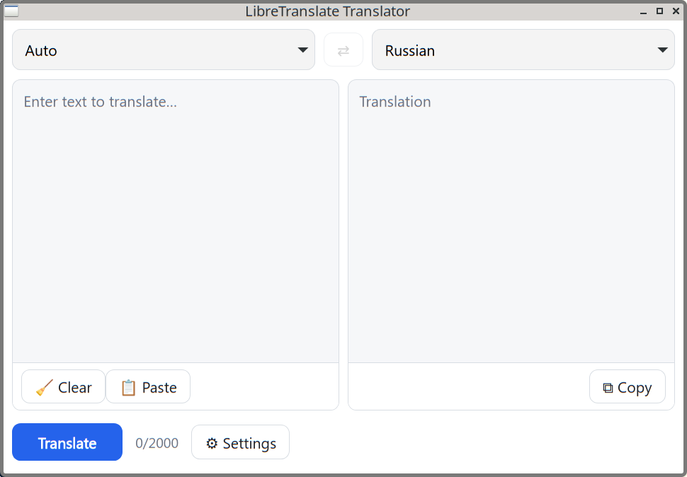
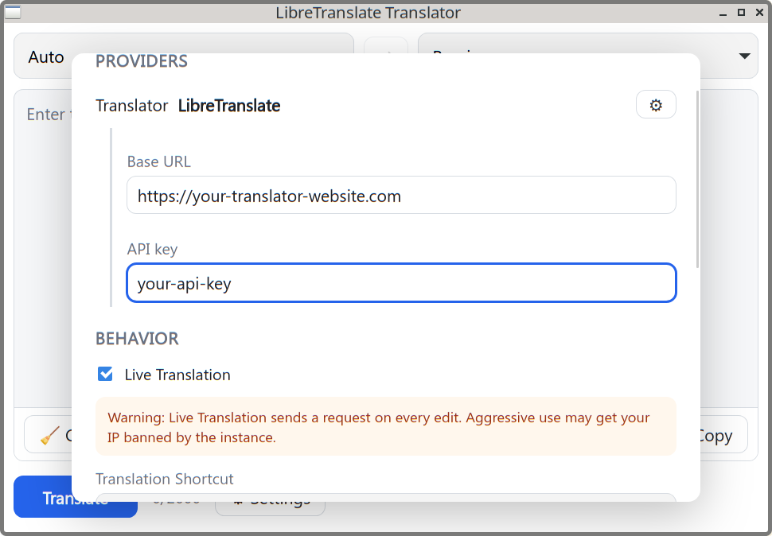

# LibreTranslate Translator

Cross-platform desktop translator built with **Go + Wails v2.12** to use 
**LibreTranslate** API for text translation. Has simple interface, little settings and a few hotkeys. Build it for my
self-hosted instance of LibreTranslate because existing apps were slow and buggy.

Contributions are welcome!

## Basic usage:

Insert text, hit Ctrl+Enter to translte. If "auto-copy" option is enabled, result will be copied to paste buffer instantly.

The app lives in the system tray: left click the tray icon to hide or show
the window, right click for a menu with "Hide/Show window" and "Quit".
Ctrl+Q pressed while the window has focus (not a global hotkey) quits the app.




## Stack
- Backend: Go 1.23+, Wails v2.12. `internal/settings` (config store) and
  `internal/libretranslate` (API client) are pure-Go and unit-tested.
- Frontend: Svelte 4 + Vite 5 + TypeScript (Wails `svelte-ts` template).
- Provider: LibreTranslate (`GET /languages`, `POST /translate`).

## Requirements
- Go 1.23+, Node 18+, Wails CLI v2.12 (`go install github.com/wailsapp/wails/v2/cmd/wails@v2.12.0`)
- Native GUI build deps: on Linux `libwebkit2gtk-4.1-dev libgtk-3-dev` + gcc
  (`webkit2gtk-4.0` on older distros); on Windows `webview2`; on macOS Xcode.

## Development
```bash
wails dev      # hot-reload dev app
```

## Production build
```bash
wails build    # outputs build/bin/translator
```

All icons (app/taskbar/tray — the same capital-T image) are rendered at
runtime by the `icons` package — no image files are committed. A pre-build
hook in `wails.json` writes the generated PNGs to `build/icons/` (hicolor
set for `make install`) and `build/appicon.png` (wails packaging) on every
build; both paths are gitignored build artifacts.

## Desktop integration (optional)

The app sets its window icon, which titlebars use — but most taskbar/dock
plugins instead resolve icons by matching the window's WM_CLASS
(`translator`) against a `.desktop` entry and looking the icon up in the
icon theme at small fixed sizes. The app deliberately does **not** install
anything into your home directory; run `make install` (or `make uninstall`)
to apply exactly the steps below, or run them manually from the repository
root:

```sh
# the binary (build first: wails build)
mkdir -p ~/.local/bin
cp build/bin/translator ~/.local/bin/translator

# icons for the hicolor theme (rendered into build/icons/ by the build)
for size in 16 22 24 32 48 64 128 256 512; do
  mkdir -p ~/.local/share/icons/hicolor/${size}x${size}/apps
  cp build/icons/${size}.png ~/.local/share/icons/hicolor/${size}x${size}/apps/translator.png
done

# application menu / taskbar entry
mkdir -p ~/.local/share/applications
cat > ~/.local/share/applications/translator.desktop <<EOF
[Desktop Entry]
Type=Application
Name=LibreTranslate Translator
Comment=Desktop client for LibreTranslate
Exec=$HOME/.local/bin/translator
Icon=translator
Terminal=false
Categories=Utility;Office;
StartupWMClass=translator
EOF
```

After a rebuild, refresh the installed binary with the same `cp`.

If `~/.local/share/icons/hicolor/icon-theme.cache` exists on your system,
refresh it too (a stale cache hides new icons):
`gtk-update-icon-cache --force --ignore-theme-index ~/.local/share/icons/hicolor`

To undo everything:

```sh
rm -f ~/.local/bin/translator
rm -f ~/.local/share/applications/translator.desktop
rm -f ~/.local/share/icons/hicolor/*/apps/translator.png
```

## Regenerate frontend bindings
After changing bound Go methods/types:
```bash
wails generate module
# On a host without CGO/GTK or a read-only HOME:
# CGO_ENABLED=0 LIBRETRANSLATE_CONFIG_DIR=/tmp/ltcfg wails generate module
```

## Tests & checks
```bash
go test ./internal/...            # backend unit tests (httptest)
go vet ./...                      # incl. main package against Wails API
cd frontend && npm run check      # svelte-check (0 errors expected)
cd frontend && npm run build      # vite production build
```

## Debug logging
Enable verbose logs (every HTTP request to LibreTranslate, settings load/save,
startup) via any of:
```bash
wails dev -- -debug                # CLI flag (or run the binary with --debug)
LIBRETRANSLATE_DEBUG=1 wails dev   # env var
```
or toggle **Settings → Developer → Debug logging**. The API key is never
logged. Logs go to stderr (visible in the terminal / `wails dev` console).

## Project layout
```
main.go, app.go        Wails entry + App lifecycle (binds 3 structs)
tray.go                System tray (hide/show toggle, quit menu)
icons/                 Code-rendered icons + gen subcommand (pre-build hook)
wails.json             Wails project config
internal/settings/     Settings store (OS config dir, JSON, atomic writes)
internal/libretranslate/  LibreTranslate client (languages/translate, timeouts, errors)
frontend/src/lib/      store, api, translate/swap logic, init, types
frontend/src/lib/components/  Translator, SettingsModal, Toast
frontend/wailsjs/go/   generated Wails bindings (do not edit)
```

## Settings
Stored at `<os.UserConfigDir>/LibreTranslateTranslator/settings.json`
(override with `LIBRETRANSLATE_CONFIG_DIR`). Defaults: Base URL
`https://libretranslate.com`, empty API key, Default-to-Auto on, Live
Translation off.
